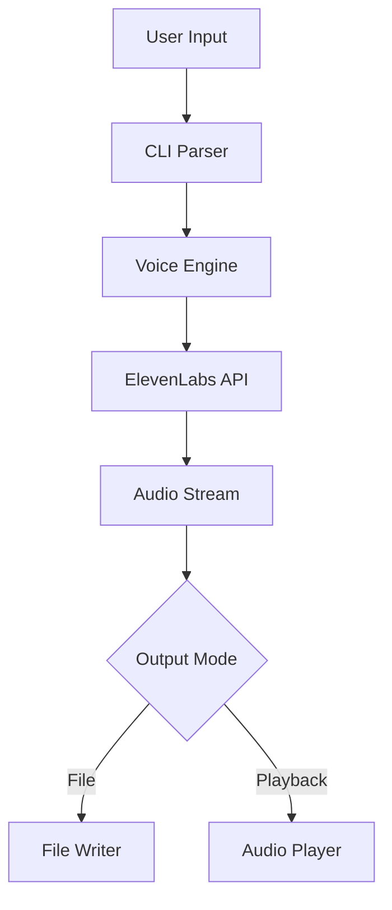

# saym Technical Specification

## Overview

saym (Say iMproved) is a command-line text-to-speech application that enhances the traditional Unix `say` command by integrating advanced voice synthesis APIs from multiple providers (ElevenLabs and Cartesia). It enables users to generate high-quality speech using pre-trained voice models from multiple providers.

## Architecture

### Core Components

1. **CLI Interface** (`src/cli.ts`)
   - Command-line argument parsing
   - Configuration management
   - User interaction handling

2. **Voice Engine** (`src/providers/`)
   - Provider abstraction layer
   - ElevenLabs API integration
   - Cartesia API integration
   - Voice synthesis orchestration
   - Audio stream management

3. **Voice Manager** (`src/voice-manager.ts`)
   - Voice model management
   - Voice parameter customization

5. **Audio Handler** (`src/audio.ts`)
   - Audio playback
   - File output management
   - Format conversion

## API Integration

### Provider Abstraction

The application uses a provider abstraction layer to support multiple TTS services:

- **TTSProvider Interface**: Common interface for all providers
- **ProviderFactory**: Creates and manages provider instances
- **Provider-specific implementations**: ElevenLabs and Cartesia

### ElevenLabs API

#### Endpoints Used

1. **Text-to-Speech**
   - `POST /v1/text-to-speech/{voice_id}`
   - `POST /v1/text-to-speech/{voice_id}/stream`

2. **Voice Management**
   - `GET /v1/voices`

### Cartesia API

#### Endpoints Used

1. **Text-to-Speech**
   - `POST /tts/bytes` - Batch TTS generation
   - `wss://api.cartesia.ai/tts/websocket` - WebSocket streaming

2. **Features**
   - Ultra-low latency (40-90ms)
   - Multiple language support


#### Request/Response Format

```typescript
interface TextToSpeechRequest {
  text: string;
  model_id?: string;
  voice_settings?: {
    stability: number;
    similarity_boost: number;
    style?: number;
    use_speaker_boost?: boolean;
  };
}

interface VoiceResponse {
  voice_id: string;
  name: string;
  samples: Array<{
    sample_id: string;
    file_name: string;
    mime_type: string;
    size_bytes: number;
  }>;
  settings: VoiceSettings;
}
```

3. **OpenAI API** (optional)

## Command-Line Interface

### Basic Syntax

```bash
saym [options] <text>
saym [options] -f <file>
```

### Options

| Option | Short | Description | Default |
|--------|-------|-------------|---------|
| `--voice` | `-v` | Voice ID or name | User's default voice |
| `--language` | `-l` | Target language code (ja, en, es, etc.) | `en` |
| `--output` | `-o` | Output file path | None (play audio) |
| `--format` | | Audio format (mp3, wav, ogg) | `mp3` |
| `--provider` | `-p` | TTS provider (elevenlabs, cartesia) | User's default |
| `--stream` | `-s` | Stream audio playback | `false` |
| `--file` | `-f` | Input text file | None |

### Language Support

The `--language` (`-l`) option specifies the target language for text-to-speech synthesis:

#### ElevenLabs Provider
- **Full support**: Language parameter directly affects voice model selection and pronunciation
- **Automatic model selection**: Non-English languages automatically use `eleven_multilingual_v2` model
- **Common codes**: `ja` (Japanese), `en` (English), `es` (Spanish), `fr` (French), `de` (German)
- **Usage**: Essential for accurate pronunciation of non-English text

```bash
# Japanese text with correct pronunciation
saym "今日は" -v "voice-id" -l ja
```

#### Cartesia Provider
- **Automatic detection**: Cartesia automatically detects language from input text
- **Optional parameter**: Language code is sent to API but not required
- **Fallback behavior**: Works without explicit language specification

```bash
# Language detection works automatically (no -l needed)
saym "今日は" -p cartesia -v "voice-id"
```

### Environment Variables

- `ELEVENLABS_API_KEY`: ElevenLabs API key (required)
- `CARTESIA_API_KEY`: Cartesia API key (optional)

## Data Flow



## Configuration

### Configuration File Format

```json
{
  "defaultVoice": "voice_id",
  "defaultLanguage": "en",
  "autoTranslate": true,
  "outputFormat": "mp3",
  "ttsProvider": "elevenlabs"
}
```

## Voice Management

Voice models are created through the respective provider's web interfaces:

- **ElevenLabs**: Use the [ElevenLabs Voice Lab](https://elevenlabs.io/voice-lab) to create custom voices
- **Cartesia**: Use the Cartesia web interface to create voice models

Once created, voices can be used with saym by referencing their voice ID.

## Error Handling

### Error Codes

| Code | Description | Resolution |
|------|-------------|------------|
| `E001` | Missing API key | Set ELEVENLABS_API_KEY |
| `E002` | Invalid voice ID | Check voice exists |
| `E004` | Audio playback error | Check audio system |
| `E005` | Network error | Check connection |
| `E006` | Quota exceeded | Check API limits |

### Retry Logic

- Automatic retry for network errors (3 attempts)
- Exponential backoff: 1s, 2s, 4s
- Circuit breaker for API failures

## Performance Considerations

### Streaming

- Chunked audio streaming for large texts
- Progressive playback during synthesis
- Reduced memory footprint

## Security

### API Key Management

- Environment variable storage
- No hardcoded credentials
- Secure key transmission

### Data Privacy

- No persistent storage of synthesized text
- Optional cache encryption
- Secure deletion of temporary files

## Testing

### Unit Tests

```bash
npm test
```

### Integration Tests

```bash
npm run test:integration
```

### Test Coverage

- CLI argument parsing: 95%
- API integration: 90%
- Audio handling: 85%

## Future Enhancements

1. **Batch Processing**
   - Multiple text inputs
   - Parallel synthesis
   - Queue management

2. **Advanced Features**
   - SSML support
   - Emotion control
   - Voice mixing

3. **Platform Integration**
   - System notifications
   - Accessibility features
   - IDE plugins