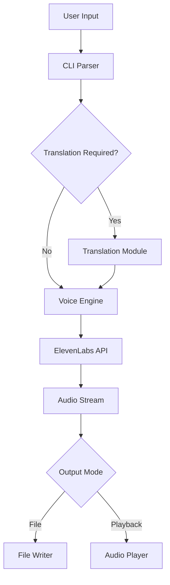

# saym Technical Specification

## Overview

saym (Say iMproved) is a command-line text-to-speech application that enhances the traditional Unix `say` command by integrating ElevenLabs' advanced voice synthesis API. It enables users to create custom voice models, translate text, and generate high-quality speech in multiple languages.

## Architecture

### Core Components

1. **CLI Interface** (`src/cli.ts`)
   - Command-line argument parsing
   - Configuration management
   - User interaction handling

2. **Voice Engine** (`src/voice-engine.ts`)
   - ElevenLabs API integration
   - Voice synthesis orchestration
   - Audio stream management

3. **Translation Module** (`src/translator.ts`)
   - Multi-language translation support
   - Language detection
   - Translation API integration

4. **Voice Manager** (`src/voice-manager.ts`)
   - Voice model management
   - Voice training interface
   - Voice parameter customization

5. **Audio Handler** (`src/audio.ts`)
   - Audio playback
   - File output management
   - Format conversion

## API Integration

### ElevenLabs API

#### Endpoints Used

1. **Text-to-Speech**
   - `POST /v1/text-to-speech/{voice_id}`
   - `POST /v1/text-to-speech/{voice_id}/stream`

2. **Voice Management**
   - `GET /v1/voices`
   - `POST /v1/voices/add`
   - `DELETE /v1/voices/{voice_id}`

3. **Voice Cloning**
   - `POST /v1/voice-generation/create-voice`
   - `GET /v1/voice-generation/history`

#### Request/Response Format

```typescript
interface TextToSpeechRequest {
  text: string;
  model_id?: string;
  voice_settings?: {
    stability: number;
    similarity_boost: number;
    style?: number;
    use_speaker_boost?: boolean;
  };
}

interface VoiceResponse {
  voice_id: string;
  name: string;
  samples: Array<{
    sample_id: string;
    file_name: string;
    mime_type: string;
    size_bytes: number;
  }>;
  settings: VoiceSettings;
}
```

### Translation API

The translation module supports multiple providers:

1. **Google Translate API** (default)
2. **DeepL API** (optional)
3. **OpenAI API** (optional)

## Command-Line Interface

### Basic Syntax

```bash
saym [options] <text>
saym [options] -f <file>
```

### Options

| Option | Short | Description | Default |
|--------|-------|-------------|---------|
| `--voice` | `-v` | Voice ID or name | User's default voice |
| `--language` | `-l` | Target language code | `en` |
| `--translate` | `-t` | Enable translation | `false` |
| `--output` | `-o` | Output file path | None (play audio) |
| `--format` | | Audio format (mp3, wav, ogg) | `mp3` |
| `--stability` | | Voice stability (0.0-1.0) | `0.5` |
| `--similarity` | | Similarity boost (0.0-1.0) | `0.75` |
| `--style` | | Style exaggeration (0.0-1.0) | `0.0` |
| `--speaker-boost` | | Enable speaker boost | `true` |
| `--stream` | `-s` | Stream audio playback | `false` |
| `--list-voices` | | List available voices | - |
| `--train-voice` | | Train new voice model | - |
| `--config` | `-c` | Config file path | `~/.saymrc` |

### Environment Variables

- `ELEVENLABS_API_KEY`: ElevenLabs API key (required)
- `SAYM_DEFAULT_VOICE`: Default voice ID
- `SAYM_DEFAULT_LANGUAGE`: Default language code
- `SAYM_TRANSLATION_API`: Translation API provider
- `SAYM_CACHE_DIR`: Cache directory path

## Data Flow



## Configuration

### Configuration File Format

```json
{
  "defaultVoice": "voice_id",
  "defaultLanguage": "en",
  "autoTranslate": true,
  "outputFormat": "mp3",
  "voiceSettings": {
    "stability": 0.5,
    "similarity_boost": 0.75,
    "style": 0.0,
    "use_speaker_boost": true
  },
  "translation": {
    "provider": "google",
    "apiKey": "translation_api_key"
  },
  "cache": {
    "enabled": true,
    "maxSize": "100MB",
    "ttl": 86400
  }
}
```

## Voice Training

### Process

1. **Sample Collection**
   - Minimum 30 seconds of clear audio
   - Multiple samples recommended
   - Supported formats: mp3, wav, m4a

2. **Voice Generation**
   - Upload samples to ElevenLabs
   - Configure voice parameters
   - Generate voice model

3. **Voice Storage**
   - Store voice ID locally
   - Cache voice metadata
   - Enable quick access

### Training Command

```bash
saym --train-voice \
  --name "My Voice" \
  --description "Personal voice model" \
  --samples /path/to/samples/*.wav
```

## Error Handling

### Error Codes

| Code | Description | Resolution |
|------|-------------|------------|
| `E001` | Missing API key | Set ELEVENLABS_API_KEY |
| `E002` | Invalid voice ID | Check voice exists |
| `E003` | Translation failed | Verify language code |
| `E004` | Audio playback error | Check audio system |
| `E005` | Network error | Check connection |
| `E006` | Quota exceeded | Check API limits |

### Retry Logic

- Automatic retry for network errors (3 attempts)
- Exponential backoff: 1s, 2s, 4s
- Circuit breaker for API failures

## Performance Considerations

### Caching

1. **Voice List Cache**
   - TTL: 1 hour
   - Invalidated on voice operations

2. **Audio Cache**
   - Hash-based (text + voice + settings)
   - LRU eviction policy
   - Configurable size limit

### Streaming

- Chunked audio streaming for large texts
- Progressive playback during synthesis
- Reduced memory footprint

## Security

### API Key Management

- Environment variable storage
- No hardcoded credentials
- Secure key transmission

### Data Privacy

- No persistent storage of synthesized text
- Optional cache encryption
- Secure deletion of temporary files

## Testing

### Unit Tests

```bash
npm test
```

### Integration Tests

```bash
npm run test:integration
```

### Test Coverage

- CLI argument parsing: 95%
- API integration: 90%
- Audio handling: 85%
- Translation: 90%

## Future Enhancements

1. **Batch Processing**
   - Multiple text inputs
   - Parallel synthesis
   - Queue management

2. **Advanced Features**
   - SSML support
   - Emotion control
   - Voice mixing

3. **Platform Integration**
   - System notifications
   - Accessibility features
   - IDE plugins